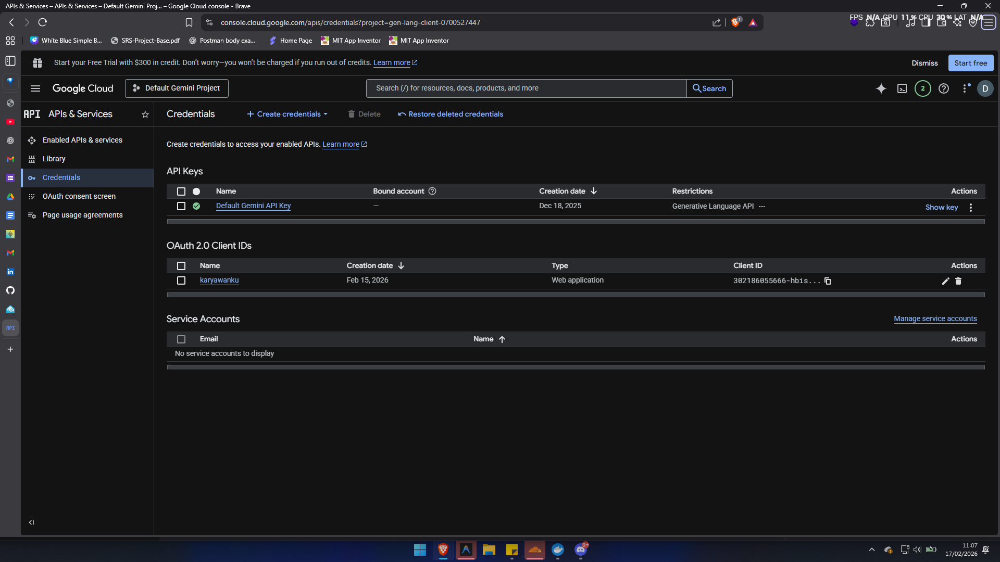
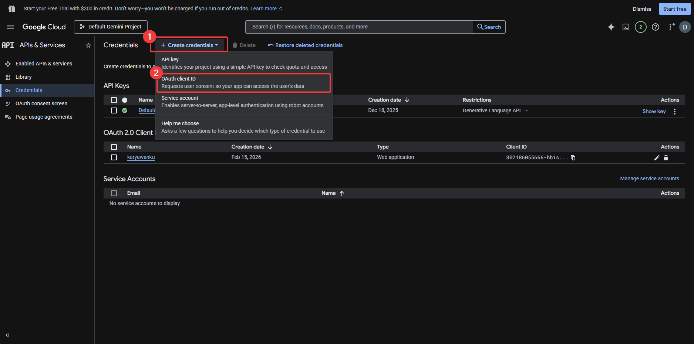
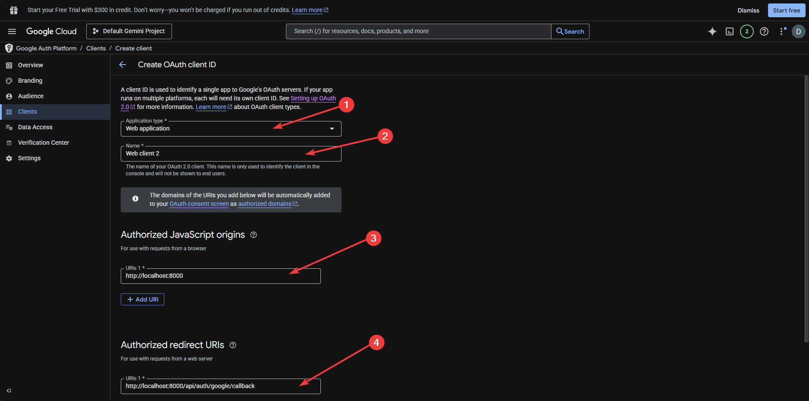
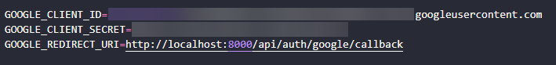

# Karyawanku

REST API sistem manajemen cuti karyawan. Dibuat pakai Laravel 12.

## Tech Stack

- PHP 8.4
- Laravel 12
- Laravel Sanctum (API Token Auth)
- Laravel Socialite (Google OAuth)
- PostgreSQL
- Docker

## Setup

```bash
# clone repo
git clone https://github.com/DandiKurnia/karyawanku.git
cd karyawanku

# install dependency
composer install

# copy env & generate key
cp .env.example .env
php artisan key:generate

# jalankan migrasi
php artisan migrate

# jalankan server
php artisan serve
```

### Konfigurasi `.env`

Sesuaikan bagian ini di file `.env`:

```env
DB_CONNECTION=pgsql
DB_HOST=127.0.0.1
DB_PORT=5432
DB_DATABASE=karyawanku
DB_USERNAME=root
DB_PASSWORD=

# Google OAuth
GOOGLE_CLIENT_ID=xxx
GOOGLE_CLIENT_SECRET=xxx
GOOGLE_REDIRECT_URI=http://localhost:8000/api/auth/google/callback
```

### Setup Google OAuth

Untuk fitur login dengan Google, perlu buat OAuth Client ID di Google Cloud Console.

1. Buka [Google Cloud Console](https://console.cloud.google.com/), buat project baru atau pakai yang sudah ada, lalu masuk ke menu **APIs & Services > Credentials**



2. Klik **+ Create Credentials** dan pilih **OAuth client ID**



3. Isi form:
    - **Application type**: Web application
    - **Name**: bebas (misal nama project)
    - **Authorized JavaScript origins**: `http://localhost:8000`
    - **Authorized redirect URIs**: `http://localhost:8000/api/auth/google/callback`



4. Setelah dibuat, akan muncul **Client ID** dan **Client Secret**. Copy keduanya


5. Paste ke file `.env`



## Alur Sistem

### Authentication

Ada 2 cara login:

1. **Konvensional** — register + login pakai email & password
2. **OAuth Google** — login pakai akun Google via Socialite

Keduanya menghasilkan Bearer Token (Sanctum) yang dipakai untuk akses endpoint yang butuh auth.

### Role

Sistem punya 2 role:

- **Employee** — bisa ajukan cuti, lihat status pengajuannya, dan cek sisa kuota
- **Admin** — bisa lihat semua pengajuan, approve/reject, dan kelola jatah cuti karyawan

### Alur Pengajuan Cuti

1. Employee kirim pengajuan cuti (tanggal mulai, tanggal selesai, alasan, lampiran)
2. Sistem validasi: cek tanggal tidak overlap, kuota masih cukup, dan tahun harus sama
3. Pengajuan masuk dengan status **pending**
4. Admin review dan memutuskan **approved** atau **rejected**
5. Saat approve, sistem cek ulang kuota supaya tidak melebihi batas

### Perhitungan Kuota

Setiap karyawan punya jatah **12 hari cuti per tahun**. Sisa kuota dihitung dinamis:

```
sisa = jatah_cuti - total_hari_yang_sudah_diapprove
```

Jadi tidak ada kolom `used_days` di database. Ini supaya data selalu konsisten tanpa risiko out-of-sync.

### Arsitektur

```
app/
├── Helpers/
│   └── ResponseFormatter.php         # format response konsisten
├── Http/
│   ├── Controllers/Api/
│   │   ├── Admin/
│   │   │   ├── LeaveEntitlementsController   # kelola jatah cuti
│   │   │   └── LeaveRequestsController       # review & decide cuti
│   │   ├── Employee/
│   │   │   └── LeaveRequestsController       # ajukan & pantau cuti
│   │   ├── SocialAuthController              # OAuth Google
│   │   └── UserController                    # register, login, logout
│   ├── Requests/                             # validasi input (Form Request)
│   └── Resources/
│       └── UserResource                      # transform data user untuk response
├── Models/
│   ├── User
│   ├── LeaveEntitlements
│   ├── LeaveRequests
│   └── SocialAccount
```

Controller dipisah berdasarkan role (Admin & Employee) supaya logic tidak campur. Validasi input pakai Form Request biar controller tetap bersih. Semua response pakai `ResponseFormatter` supaya format JSON konsisten di seluruh endpoint.

## API Endpoints

### Public

- `POST /api/register` — register
- `POST /api/login` — login
- `GET /api/auth/google/redirect` — redirect ke Google
- `GET /api/auth/google/callback` — callback OAuth
- `POST /api/auth/google/token` — login pakai Google token

### Employee (perlu auth)

- `GET /api/leave-requests` — list pengajuan cuti sendiri
- `POST /api/leave-requests` — ajukan cuti baru
- `GET /api/leave-requests/{id}` — detail pengajuan
- `PATCH /api/leave-requests/{id}/cancel` — batalkan (kalau masih pending)
- `GET /api/my-leave-quota` — cek sisa kuota (bisa filter `?year=2025`)

### Admin (perlu auth)

- `GET /api/admin/leave-requests` — list semua pengajuan
- `GET /api/admin/leave-requests/{id}` — detail pengajuan
- `PATCH /api/admin/leave-requests/{id}/decide` — approve/reject
- `GET /api/admin/leave-entitlements` — list jatah cuti
- `POST /api/admin/leave-entitlements` — buat jatah cuti
- `GET /api/admin/leave-entitlements/{id}` — detail jatah cuti
- `PUT /api/admin/leave-entitlements/{id}` — update jatah cuti

### Logout

- `POST /api/logout`

## Deploy dengan Docker

Proyek ini sudah support Docker. Ada 3 container: `app` (PHP-FPM), `nginx`, dan `db` (PostgreSQL).

```bash
# pastikan .env sudah dikonfigurasi, terutama:
# DB_HOST=db
# DB_DATABASE=karyawanku

# build & jalankan
docker compose up -d --build

# setup Laravel
docker compose exec app php artisan key:generate
docker compose exec app php artisan migrate
docker compose exec app php artisan storage:link
```

Akses di `http://localhost:8001`

Untuk stop:

```bash
docker compose down
```

## Dokumentasi Postman

[https://documenter.getpostman.com/view/22817609/2sBXcDEzza](https://documenter.getpostman.com/view/22817609/2sBXcDEzza)

File environment dan collection Postman juga tersedia di Google Drive.

[google drive](https://drive.google.com/drive/folders/1fRFr0Z3WtTYJruGBtXFO1Ss_Z1pmlrsf?usp=sharing)
